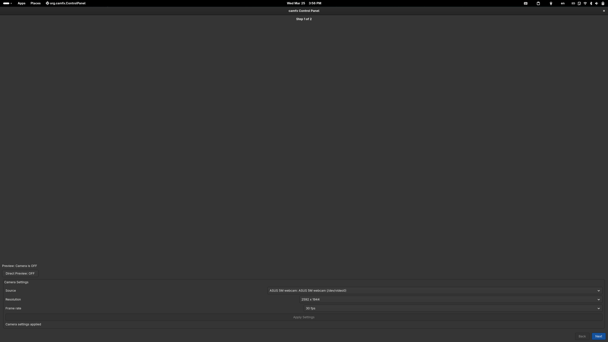
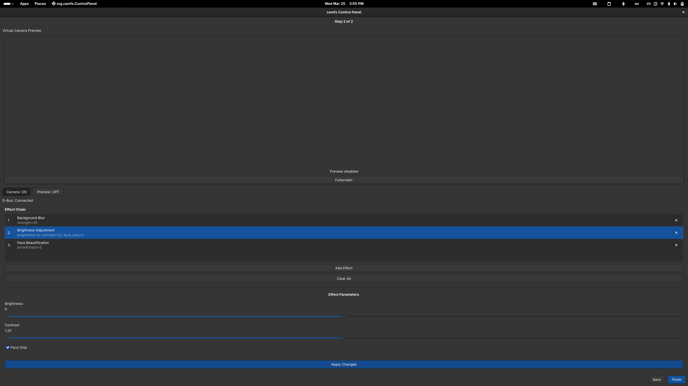

# camfx

A lightweight, modular camera video enhancement middleware for Linux that outputs to a universal V4L2 virtual camera (`/dev/videoX`) using `v4l2loopback` + FFmpeg. Includes both a CLI and a GTK GUI for effect management.

## What’s included
- V4L2-only backend (no PipeWire in core)
- Real-time effect chain (live switching via D-Bus)
- Effects:
  - `blur` (background blur)
  - `replace` (background replacement)
  - `brightness` (+ optional `--face-only`)
  - `beautify` (skin smoothing)
  - `autoframe` (face-centered framing)
  - `gaze-correct` (experimental eye warp)
- MediaPipe **Tasks** backend for segmentation + landmarks (lazy init + cached models)
- Tests: unit tests for effect chaining and device helpers (`pytest`)

## Status (as of this refactor)
- ✅ Effects + effect chaining via CLI/D-Bus
- ✅ V4L2 loopback virtual camera output
- ✅ MediaPipe Tasks models + segmentation/landmarks effects
- ✅ GTK GUI (including preview stability improvements)
- ⚠️ Performance depends on your webcam + transport (some webcams can’t sustain 30 FPS at 1080p)

## Prerequisites
- `ffmpeg`
- `v4l2loopback` kernel module (creates `/dev/videoX`)
- Python 3.12
- A working camera exposed as `/dev/video*`

### Optional
- GUI: GTK4 + PyGObject (`pip install -e ".[gui]"`)
- D-Bus control: `dbus-python` (`pip install -e ".[dbus]"`)

## Installation

```bash
# 1) Python venv (Python 3.12)
python3.12 -m venv .venv
source .venv/bin/activate

# 2) Upgrade tooling
python -m pip install -U pip wheel setuptools

# 3) Dependencies
pip install -r requirements.txt

# 4) Install package (editable for dev)
pip install -e .
```

Optional extras:
- GUI:
  - `pip install -e ".[gui]"`
- D-Bus:
  - `pip install -e ".[dbus]"`

### ML Models (MediaPipe Tasks)
Models are downloaded lazily on first use, cached locally, and can be pre-downloaded:

```bash
camfx models-download
```

Cache location:
- default: `~/.cache/camfx/models`
- override: `CAMFX_MODELS_DIR=/path/to/models`

## V4L2 loopback setup
`camfx` auto-discovers the virtual node by `card_label` (defaults to `--name` / `camfx`).

Examples (Fedora):

```bash
sudo dnf install -y v4l2loopback akmod-v4l2loopback

# Load module (let kernel choose video_nr)
sudo modprobe v4l2loopback exclusive_caps=1 card_label="camfx" video_nr=-1

# Verify
v4l2-ctl --list-devices
ls -l /dev/video*
```

## Quickstart (CLI)

### 1) Start daemon (camera initially OFF with `--dbus`)
```bash
camfx start --dbus --name camfx
```

### 2) Start the camera streaming
```bash
camfx camera-start
```

### 3) Add effects
List effects:
```bash
camfx effects
```

Example:
```bash
camfx set-effect --effect blur --strength 25
```

Background replace:
```bash
camfx add-effect --effect replace --image /path/to/background.jpg
```

Face-only brightness:
```bash
camfx add-effect --effect brightness --brightness 20 --face-only
```

### 4) Stop
```bash
camfx camera-stop
```

## Preview

Preview virtual output:
```bash
camfx preview-virtual --name camfx --v4l2-device auto
```

Preview physical camera directly (bypasses the v4l2 loopback):
```bash
camfx preview-camera --input 0
```

## CLI Reference (high level)

### Daemon
- `camfx start [--dbus] [--name] [--input] [--width] [--height] [--fps] [--v4l2-device]`

### Camera control (requires `--dbus`)
- `camfx camera-start`
- `camfx camera-stop`
- `camfx camera-status`

### Effects (via D-Bus, requires `--dbus`)
- `camfx effects` (list effect options)
- `camfx set-effect --effect <key> [params...]` (replace chain)
- `camfx add-effect --effect <key> [params...]` (update if key already exists)
- `camfx remove-effect --index <n>` or `--effect <key>`
- `camfx get-effects`

## GUI
Launch the GTK control panel:
```bash
camfx gui
```

The GUI expects `camfx start --dbus` to control camera/effects. It also lets you toggle preview.

### Screenshots
Step 1 (open the GUI and connect preview):  


Step 2 (fullscreen preview):  


## Performance notes
- `camfx` outputs frames to v4l2loopback via FFmpeg. Your achievable FPS depends on:
  - camera supported formats (compressed MJPEG vs raw YUYV, etc.)
  - USB bandwidth and sustained capture
  - whether ML effects are enabled
- If you request `--fps 30` but your webcam can’t sustain it, you may observe lower FPS or buffer drops.

### Practical tip
If your camera offers MJPEG at high resolution, prefer MJPEG. `camfx` attempts to switch to MJPEG for “large” resolutions automatically.

## Troubleshooting

### v4l2loopback not visible / virtual device not found
```bash
lsmod | rg v4l2loopback
v4l2-ctl --list-devices
ls -l /dev/video*
```

If auto-discovery fails, pass an explicit node:
- `camfx start --v4l2-device /dev/videoX ...`

If `/dev/videoX` exists but GNOME Camera/other PipeWire apps do not show it yet,
restart user services so PipeWire/WirePlumber re-discover the node:
```bash
systemctl --user restart pipewire wireplumber xdg-desktop-portal xdg-desktop-portal-gnome
```

### Permissions
If opening `/dev/videoX` fails:
```bash
sudo usermod -aG video "$USER"
```
(log out/in or reboot)

### MediaPipe issues
- Run `camfx models-download` to prefetch models.
- Ensure `mediapipe` is installed in your venv.

## Tests
```bash
pytest -q
pytest -v
pytest tests/test_effect_chaining.py -v
pytest tests/test_camera_devices.py -v
```

## License
MIT

